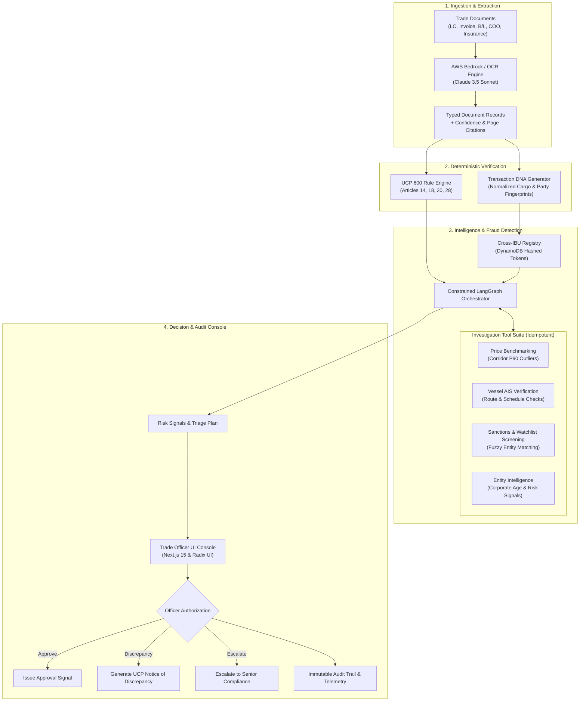

# 🛡️ TradeSentry — Trade Finance Intelligence Layer

<div align="center">


**AWS-native, human-authorized pre-settlement intelligence & compliance engine engineered for GIFT City International Banking Units (IBUs).**

[](https://python.org)
[](https://fastapi.tiangolo.com)
[](https://nextjs.org)
[](https://aws.amazon.com/bedrock/)
[](https://langchain.com)
[](https://aws.amazon.com/dynamodb/)
[](#-disclaimer--guardrails)

[Key Capabilities](#-key-capabilities) • [System Architecture](#-system-architecture) • [Demo Scenarios](#-pre-seeded-demo-cases) • [API Reference](#-api-reference) • [Local Quickstart](#-getting-started) • [Security & Guardrails](#-regulatory-guardrails--invariants)

</div>

---

## 📌 Executive Summary

Trade finance powers international commerce, but banks face two critical vulnerabilities:
1. **Labor-Intensive Documentary Checking**: Manual verification of multi-document presentations against intricate **ICC UCP 600** banking rules.
2. **Catastrophic Cross-Bank Fraud**: Duplicate invoice & Bill of Lading (B/L) financing across distinct banking units, alongside complex **Trade-Based Money Laundering (TBML)**.

**TradeSentry** acts as a pre-settlement co-pilot for Trade Finance Officers in GIFT City. It automates multi-document OCR extraction with confidence scoring, applies a **100% deterministic UCP 600 rule engine** (eliminating LLM hallucinations in rule checks), computes cryptographic **Transaction DNA** cargo fingerprints, queries privacy-preserving **Cross-IBU registries** to prevent double-financing, and provides an auditable, human-in-the-loop investigation console.

---

## 🏛️ System Architecture



---

## ⚡ Key Capabilities

### 1. 📄 Multi-Document Ingestion & Live Extraction
- Native PDF processing for Letters of Credit (MT700 / LC), Commercial Invoices, Bills of Lading, Packing Lists, Certificates of Origin, and Marine Insurance Certificates.
- Powered by **AWS Bedrock (Claude 3.5 Sonnet)** with deterministic fallback parsers.
- Returns strictly typed fields, confidence scores (0.0–1.0), and page-level evidence citations for every data point.

### 2. ⚖️ Deterministic ICC UCP 600 Compliance Engine
- **Zero LLM Hallucinations**: Rule compliance is evaluated strictly via deterministic Python rules.
- **Article 18**: Commercial Invoice goods description consistency, currency matching against LC, and amount non-excess checks.
- **Article 20**: Bill of Lading port of loading/discharge consistency and on-board notation verification.
- **Article 14 / 28**: Marine Insurance certificate coverage requirements (110% CIF value) and expiry date validation against shipment dates.
- Produces itemized discrepancy reports with Expected vs. Actual values and exact clause references.

### 3. 🧬 Transaction DNA (Cryptographic Cargo Fingerprints)
- Computes canonical, normalized SHA-256 fingerprints across cargo attributes:
  - Bill of Lading number & carrier code
  - Normalized container numbers & vessel IMO
  - Normalized commodity HS code & net weight
  - Exporter & Importer identity identifiers
- Prevents tampering and identifies duplicate presentation attempts across multiple documents.

### 4. 🌐 Privacy-Preserving Cross-IBU Duplicate Registry
- Simulated shared ledger powered by **Amazon DynamoDB** with Global Secondary Indexes (GSIs).
- Allows GIFT City IBUs (International Banking Units) to detect duplicate collateral and invoice financing attempts in real time.
- **Zero Customer PII Exposure**: Only one-way cryptographic tokens and anonymized reference metadata are queried across banking boundaries.

### 5. 🔍 Constrained LangGraph Fraud & TBML Investigation
- Automated investigation agent running under strict operational bounds:
  - Max 12-call budget per investigation cycle.
  - Read-only, idempotent tools with provenance logging and structured caveats.
  - Dedicated tools: **Price Outlier Analysis**, **Vessel AIS Route Verification**, **Sanctions Screening**, and **Entity Corporate History**.
- Every execution emits hashed telemetry and detailed audit events.

### 6. 🛡️ Human-in-the-Loop Officer Console
- Clean, high-density Web UI built with **Next.js 15**, **Tailwind CSS**, and **Radix UI**.
- Real-time case triage, visual risk breakdown, interactive document viewers, and step-by-step discrepancy resolution.
- Complete regulatory audit trail with full request/response event replay.

---

## 🛡️ Regulatory Guardrails & Invariants

All development and automated agent workflows strictly enforce the mandatory invariants defined in [`AGENTS.md`](./AGENTS.md):

| # | Invariant Rule | Description |
|---|---|---|
| **1** | **No UCP 600 Modification** | Never invent, modify, or loosen ICC UCP 600 documentary compliance rules. |
| **2** | **No Settlement Execution** | Never execute, trigger, or simulate financial settlement. FCSS is downstream infrastructure. |
| **3** | **Approved Tool Allow-List** | Investigation workflows can only invoke explicit, read-only tools within designated call budgets. |
| **4** | **Standardized Evidence** | Every compliance finding requires: `Rule ID`, `UCP Article`, `Expected Value`, `Actual Value`, and `Evidence`. |
| **5** | **Zero PII & Secret Logging** | Raw document text, auth tokens, signed S3 URLs, and customer PII are strictly barred from logs. |
| **6** | **Signal ≠ Legal Finding** | Risk scores and triage metrics are investigative signals, not definitive legal conclusions of fraud. |
| **7** | **Demo Value Thresholds** | All weights, scoring models, and price benchmark margins are prototype demo values. |
| **8** | **Human Sign-Off Required** | Every consequential action (approval, discrepancy notice, escalation) requires human officer authorization. |
| **9** | **Read-Only Case State** | Agent workflows inspect state and emit recommendations; they never directly mutate database records. |
| **10** | **Downstream Independence** | TradeSentry remains decoupled from payment networks and core banking settlement rails. |

---

## 🧪 Pre-Seeded Demo Cases

The platform includes 4 synthetic demo scenarios representing real-world trade finance situations:

```
fixtures/sample_documents/
├── case_a_clean/         # DEMO-CASE-A: Fully compliant LC & clean documentary presentation
├── case_b_duplicate/     # DEMO-CASE-B: Duplicate B/L financing attempt flagged by Cross-IBU registry
├── case_c_tbml/          # DEMO-CASE-C: Price over-invoicing & high-risk corridor TBML flags
└── case_d_legit/         # DEMO-CASE-D: Legitimate high-value commodity trade with complex cargo specs
```

| Demo Case ID | IBU ID | Description | Primary Flags / Outcome |
|---|---|---|---|
| **`DEMO-CASE-A`** | `IBU-A` | Standard Clean Presentation | `PASSED` — All UCP 600 rules match; 0 discrepancies; Ready for Review. |
| **`DEMO-CASE-B`** | `IBU-B` | Duplicate Collateral Financing | `DUPLICATE_FINANCING_RISK` — Cross-IBU alert: B/L already pledged at IBU-C. |
| **`DEMO-CASE-C`** | `IBU-A` | Trade-Based Money Laundering | `PRICE_OUTLIER` + `SANCTIONS_FLAG` — 42% over benchmark; high-risk entity. |
| **`DEMO-CASE-D`** | `IBU-C` | Multi-Vessel Legitimate Cargo | `INVESTIGATION_COMPLETE` — Complex transshipment verified via vessel AIS. |

---

## 🚀 Getting Started

### Prerequisites
- **Docker** & **Docker Compose**
- **Python 3.11+** (for local CLI/test execution)
- **Node.js 20+** & **npm** (for local web development)
- **AWS CLI** (optional, for Bedrock live extraction)

### 1. Clone & Configure Environment

```bash
# Clone the repository
git clone https://github.com/your-org/tradesentry.git
cd tradesentry

# Create environment configuration
cp .env.example .env
```

### 2. Launch Local Stack via Docker Compose

```bash
docker compose -f infra/docker/docker-compose.yml up --build -d
```

Services exposed:
- 🌐 **Web Console**: [http://localhost:3000](http://localhost:3000)
- 🚀 **FastAPI Backend**: [http://localhost:8000](http://localhost:8000) (Docs: [http://localhost:8000/docs](http://localhost:8000/docs))
- 🗄️ **PostgreSQL**: `localhost:5432` (`tradesentry_dev`)
- ⚡ **Redis**: `localhost:6379`
- ☁️ **LocalStack (S3 & DynamoDB)**: `http://localhost:4566`

### 3. Seed Synthetic Data

```bash
# Seed all 4 synthetic demo cases
make seed-demo

# Seed the Cross-IBU synthetic registry
make seed-registry

# Seed an individual case
make seed-case CASE=B
```

---

## 📡 API Reference

All requests representing an IBU bank require the `X-IBU-ID` header (e.g., `X-IBU-ID: IBU-A`).

### Case Management & Extraction

| Method | Endpoint | Description | Headers / Params |
|---|---|---|---|
| `POST` | `/cases` | Create a new trade finance case | `X-IBU-ID` |
| `GET` | `/cases` | List cases with filter & status | `X-IBU-ID`, `?status=...` |
| `GET` | `/cases/{case_id}` | Retrieve comprehensive case details | `X-IBU-ID` |
| `POST` | `/cases/{case_id}/documents` | Upload & ingest a trade document (PDF) | Multipart Form (`file`, `doc_type`) |
| `GET` | `/cases/{case_id}/documents` | List uploaded documents for a case | `X-IBU-ID` |
| `GET` | `/cases/{case_id}/completeness` | Check document completeness checklist | `X-IBU-ID` |

### UCP 600 Compliance & Transaction DNA

| Method | Endpoint | Description | Headers / Params |
|---|---|---|---|
| `POST` | `/cases/{case_id}/compliance` | Trigger deterministic UCP 600 validation | `X-IBU-ID` |
| `GET` | `/cases/{case_id}/compliance` | Get rule breakdown, expected vs actual values | `X-IBU-ID` |
| `POST` | `/cases/{case_id}/transaction-dna` | Compute cryptographic Transaction DNA | `X-IBU-ID` |
| `GET` | `/cases/{case_id}/transaction-dna` | Get generated DNA cargo & entity hashes | `X-IBU-ID` |

### Cross-IBU Registry & TBML Investigation

| Method | Endpoint | Description | Headers / Params |
|---|---|---|---|
| `POST` | `/cross-ibu/register` | Register document DNA fingerprint into registry | `X-IBU-ID` |
| `POST` | `/cross-ibu/query` | Query registry for duplicate financing matches | `X-IBU-ID` |
| `GET` | `/cross-ibu/registry` | Simulated admin registry overview | `X-Admin-Debug: true` |
| `POST` | `/cases/{case_id}/run` | Execute LangGraph investigation workflow | `X-IBU-ID` |
| `GET` | `/cases/{case_id}/investigation` | Get investigation steps, tool calls & signals | `X-IBU-ID` |
| `POST` | `/cases/{case_id}/review` | Submit human officer sign-off decision | `X-IBU-ID` (`APPROVE` / `DISCREPANCY`) |
| `GET` | `/audit/events` | Query immutable system audit logs | `?case_id=...&ibu_id=...` |

---

## 🛠️ Testing & Quality Assurance

```bash
# Run backend test suite (FastAPI, UCP 600 rules, DNA, LangGraph)
pytest

# Execute Ruff linting & formatting checks
ruff check .

# Execute strict MyPy type checking
mypy

# Run frontend Next.js production build check
npm --prefix apps/web run build
```

---

## ☁️ Cloud & Infrastructure Footprint

```
infra/
├── aws/
│   ├── main.tf          # Terraform: ECS Fargate, DynamoDB, S3 KMS, ALB, IAM roles
│   ├── variables.tf     # Environment and sizing configuration
│   └── outputs.tf       # Deployed service endpoints & ARN outputs
└── docker/
    ├── docker-compose.yml # Local development orchestration
    └── localstack-init.sh # Local S3 & DynamoDB bucket/table initialization
```

- **Frontend**: AWS App Runner / Next.js container with zero-config auto-scaling.
- **Backend API**: Amazon ECS Fargate running FastAPI with gunicorn/uvicorn workers.
- **Document Store**: Amazon S3 with KMS envelope encryption (SSE-KMS) and strict bucket policies.
- **Cross-IBU Shared Ledger**: Amazon DynamoDB with Global Secondary Indexes on hashed document tokens.
- **AI / LLM Layer**: Amazon Bedrock (Anthropic Claude 3.5 Sonnet) via IAM Task Role credentials (zero hardcoded API keys).

---

## 📂 Repository Structure

```
.
├── AGENTS.md                  # 10 Mandatory Agent Rules & Invariants
├── Makefile                   # Development & seeding task runner
├── pyproject.toml             # Python packaging, dependencies & tool configs
├── agents/                    # LangGraph investigation graph & state machines
├── apps/
│   ├── api/                   # FastAPI backend application & routes
│   │   └── tradesentry_api/   # Services, stores, OCR, repository & telemetry
│   └── web/                   # Next.js 15 frontend application
│       ├── app/               # App Router pages (Dashboard, Cases, Audit, DNA, etc.)
│       ├── components/        # Radix UI + Tailwind component library
│       └── services/          # API & Mock client data providers
├── cross_ibu/                 # Cross-IBU duplicate registry logic & hashing
├── dna/                       # Transaction DNA computation & normalization
├── docs/                      # Demo scripts, threat models & architecture decision records
├── fixtures/                  # Synthetic demo PDFs, pre-extracted JSON, price benchmarks
├── fraud_tbml/                # Fraud tools (Price Benchmarking, Vessel AIS, Sanctions)
├── infra/                     # Terraform AWS infrastructure & Docker compose
├── models/                    # Pydantic domain models & contracts
├── rules/                     # Deterministic UCP 600 rule implementations
├── scripts/                   # Seeding, metric evaluation & deployment scripts
└── tests/                     # Unit, integration & regression test suites
```

---

## 📄 Disclaimer & Prototype Notice

> [!WARNING]
> **Prototype Demonstration Notice**  
> TradeSentry is a prototype demonstration platform engineered to illustrate AI-assisted pre-settlement compliance and intelligence. All risk thresholds, price benchmark figures, cross-IBU weights, and entity registries utilize synthetic demo data and do not represent formal regulatory standards or calibrated production scoring models. Settlement actions are strictly handled by downstream banking infrastructure (such as FCSS) with mandatory human authorization.

---

<div align="center">
Built with 🛡️ for GIFT City International Banking Units.
</div>
